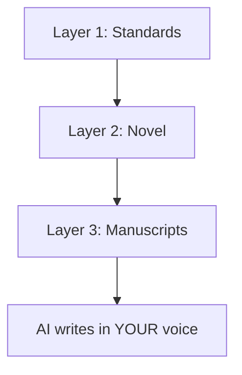

# Novel-OS

<div align="center">


</div>

> **Transform AI from confused assistant to trusted writing partner**

Novel-OS is a structured workflow system that gives AI the context it needs to help you write compelling fiction—consistently and efficiently. Stop wrestling with inconsistent prose and lost plot threads. Start writing novels that sound like you.

<div align="center">

**Works With Any AI Tool** | **Any Genre or Length** | **Your Voice, Your Way**

</div>

---

## Why Authors Choose Novel-OS

<table>
<tr>
<td width="33%">

### **Complete Creative Context**
Unlike basic AI setups, Novel-OS provides three layers of context:
- **Standards** - Your writing style & techniques
- **Novel** - Story premise & creative decisions  
- **Manuscripts** - Detailed outlines & tasks

*Result: AI writes prose that sounds like YOU*

</td>
<td width="33%">

### **Structured Writing Process**
Replaces random prompting with proven workflows:
- Comprehensive story outlines
- Manageable scenes & writing tasks
- Character consistency tracking
- Progress milestone management

*Result: Complete novels faster with consistent quality*

</td>
<td width="33%">

### **Your Voice, Your Way**
Completely customizable to your process:
- Define your unique writing style
- Create genre-specific guidelines
- Adapt every workflow
- Works with any AI tool

*Result: AI partner that thinks YOUR way*

</td>
</tr>
</table>

## How Novel-OS Works: Three Layers of Context

> Novel-OS works like briefing a human writing partner—each layer builds complete understanding of your creative process.



### **Layer 1: Writing Standards** 
*Set once, use everywhere*

| Component | Purpose | Location |
|-----------|---------|----------|
| **Writing Style** | Narrative voice, POV, prose style | `~/.novel-os/standards/` |
| **Genre Guides** | Genre conventions & techniques | `standards/genre-guides/` |
| **Narrative Techniques** | Character development, pacing | `standards/narrative-techniques.md` |

### **Layer 2: Your Novel**
*Project-specific creative vision*

- **Premise** — What you're writing and why it matters
- **Writing Plan** — Story phases and completion targets  
- **Decisions** — Key creative choices with rationale
- **Novel Style** — Voice specific to this story

*Location: `.novel-os/novel/`*

### **Layer 3: Manuscripts**
*Detailed writing roadmap*

- **Story Outline** — Plot structure and character arcs
- **Character Profiles** — Development and relationships
- **Writing Tasks** — Scene-by-scene objectives

*Location: `.novel-os/manuscripts/[date-story]/`*

---

**The Result:** Your AI has everything needed—*how you write*, *what you're writing*, and *what to write next*.

## Installation

<div align="center">

### Choose Your Installation Method

</div>

<table>
<tr>
<td width="33%">

#### **macOS/Linux**
```bash
# One-line install
curl -sSL https://raw.githubusercontent.com/forsonny/book-os/main/setup.sh | sed 's/\r$//' | bash
```

</td>
<td width="33%">

#### **Windows**
```powershell
# PowerShell (Recommended)
Invoke-WebRequest -Uri "https://raw.githubusercontent.com/forsonny/book-os/main/setup.ps1" -OutFile "setup.ps1"
.\setup.ps1
```

```cmd
# Command Prompt Alternative
curl -o setup.bat https://raw.githubusercontent.com/forsonny/book-os/main/setup.bat
setup.bat
```

</td>
<td width="33%">

#### **WSL (Windows Subsystem for Linux)**
```bash
# WSL-optimized install
curl -sSL https://raw.githubusercontent.com/forsonny/book-os/main/setup-wsl.sh | sed 's/\r$//' | bash
```

> **🐧 WSL Features:**
> - Enhanced path handling
> - Environment variable setup
> - File permission optimization
> - WSL-specific troubleshooting

[**📖 WSL Guide**](book-os/README_WSL.md)

</td>
</tr>
</table>

> **What this installs:** Core Novel-OS framework to `~/.novel-os/` with writing standards and workflow templates.

> **Important:** Customize the standards files after installation to match your writing preferences!

### **Tool Integration Setup**

<details>
<summary><b>Claude Code Integration</b> (Click to expand)</summary>

<table>
<tr>
<td width="33%">

**macOS/Linux:**
```bash
curl -sSL https://raw.githubusercontent.com/forsonny/book-os/main/setup-claude-code.sh | sed 's/\r$//' | bash
```

</td>
<td width="33%">

**Windows:**
```powershell
# PowerShell
Invoke-WebRequest -Uri "https://raw.githubusercontent.com/forsonny/book-os/main/setup-claude-code.ps1" -OutFile "setup-claude-code.ps1"
.\setup-claude-code.ps1
```

</td>
<td width="33%">

**WSL:**
```bash
# WSL-optimized
curl -sSL https://raw.githubusercontent.com/forsonny/book-os/main/setup-claude-code-wsl.sh | sed 's/\r$//' | bash
```

</td>
</tr>
</table>

**Enables commands:** `/plan-novel` • `/create-outline` • `/write-scenes` • `/analyze-manuscript`

**Installs output style:** `novel-os-assistant` - Optimizes Claude Code for novel writing workflows

</details>

<details>
<summary><b>Cursor Integration</b> (Click to expand)</summary>

> **First:** Navigate to your novel project's root folder

<table>
<tr>
<td width="50%">

**macOS/Linux:**
```bash
curl -sSL https://raw.githubusercontent.com/forsonny/book-os/main/setup-cursor.sh | sed 's/\r$//' | bash
```

</td>
<td width="50%">

**Windows:**
```powershell
# PowerShell
Invoke-WebRequest -Uri "https://raw.githubusercontent.com/forsonny/book-os/main/setup-cursor.ps1" -OutFile "setup-cursor.ps1"
.\setup-cursor.ps1
```

</td>
</tr>
</table>

**Enables commands:** `@plan-novel` • `@create-outline` • `@write-scenes` • `@analyze-manuscript`

</details>

### **Verify Installation**

<table>
<tr>
<td width="50%">

**macOS/Linux:**
```bash
# Quick check
ls ~/.novel-os/
```

</td>
<td width="50%">

**Windows:**
```powershell
# Full verification
.\verify-installation.ps1
```

```cmd
# Alternative
verify-installation.bat
```

</td>
</tr>
</table>

> **What verification checks:** File structure • Dependencies • Troubleshooting guidance

## Getting Started with Novel-OS

### **1. Activate Novel-OS Assistant Mode (Claude Code)**

For the best Novel-OS experience in Claude Code, switch to the specialized writing output style:

```plaintext
/output-style novel-os-assistant
```

This transforms Claude Code into a creative writing specialist optimized for Novel-OS workflows.

### **2. Customize Your Writing Standards**
> **Pro tip:** The more specific your standards, the more consistent your AI assistance!

<table>
<tr>
<td width="50%">

**macOS/Linux:**
- Writing style: `~/.novel-os/standards/writing-style.md`
- Techniques: `~/.novel-os/standards/narrative-techniques.md`  
- Genre guides: `~/.novel-os/standards/genre-guides/[genre].md`

</td>
<td width="50%">

**Windows:**
- Writing style: `%USERPROFILE%\.novel-os\standards\writing-style.md`
- Techniques: `%USERPROFILE%\.novel-os\standards\narrative-techniques.md`
- Genre guides: `%USERPROFILE%\.novel-os\standards\genre-guides\[genre].md`

</td>
</tr>
</table>

### **3. Start a New Novel**

<div align="center">

**Use the `/plan-novel` command**

</div>

```plaintext
/plan-novel

I want to write a literary fiction novel about a woman who inherits 
her grandmother's bookshop in a small coastal town.

Key themes: family legacy, small-town community, second chances
Target readers: Adult literary fiction fans who enjoy character-driven stories  
Writing style: Third person limited, lyrical prose, present tense
```

<details>
<summary><b>What AI Will Create</b> (Click to see)</summary>

- **Novel structure** (`.novel-os/novel/` directory)
- **Story premise** (`premise.md` with complete vision) 
- **Writing roadmap** (phases, milestones, targets)
- **Creative decisions** (documented with rationale)
- **Custom style guide** (novel-specific voice)

</details>

### **4. Add Novel-OS to Existing Work**

<div align="center">

**Use the `/analyze-manuscript` command**

</div>

```plaintext
/analyze-manuscript

I want to install Novel-OS into my existing mystery novel project.
I have 3 completed chapters and detailed character notes.
```

<details>
<summary><b>What AI Will Analyze</b> (Click to see)</summary>

- **Current structure** (files, chapters, organization)
- **Writing style** (voice, POV, genre detection)
- **Documentation** (reflects existing content)
- **Integration** (adds completed work to writing plan)

</details>

### **5. Create Detailed Outlines**

<div align="center">

**Use the `/create-outline` command**

</div>

```plaintext
/create-outline

Create a detailed outline for my 1920s Chicago mystery novel.
Focus on the detective's investigation of a speakeasy murder.
```

<details>
<summary><b>What Gets Created</b> (Click to see)</summary>

- **Complete story outline** (plot structure & pacing)
- **Character profiles** (arcs, relationships, development)
- **World-building** (setting details & atmosphere)
- **Writing tasks** (scene-by-scene breakdown)

</details>

### **6. Write Compelling Scenes**

<div align="center">

**Use the `/write-scenes` command**

</div>

```plaintext
/write-scenes

Write the opening scene where Detective Murphy discovers 
the first clue hidden in the speakeasy's secret room.
```

<details>
<summary><b>How AI Writes</b> (Click to see)</summary>

- **Your exact style** (voice, tone, technique)
- **Character consistency** (dialogue, behavior, growth)
- **Plot advancement** (follows outline structure)
- **Progress tracking** (updates milestones automatically)
- **Session management** (clear start/stop points)

</details>

## Common Writing Workflows

<table>
<tr>
<td width="33%">

### **Quick Status Check**
```plaintext
What's next on the writing plan?
```

AI checks your writing plan and suggests the next scene or chapter to tackle.

</td>
<td width="33%">

### **Character Development**
```plaintext
/create-outline

Develop the relationship between 
my protagonist and her sister
```

Creates structured character work with clear objectives.

</td>
<td width="33%">

### **Continue Previous Work**
```plaintext
/write-scenes

Continue where we left off 
with Chapter 5
```

AI reads your tasks and picks up exactly where you stopped.

</td>
</tr>
</table>

## Best Practices for Success

<table>
<tr>
<td width="50%">

### **Writing Standards**
- **Be specific about voice** 
  *"Third person limited with lyrical prose"*
- **Define character consistency**
  *Include dialogue patterns & traits*  
- **Set genre expectations**
  *Clear guidelines for conventions*

### **Story Planning**
- **Review outlines carefully**
  *Planning phase determines quality*
- **Character development first**
  *Strong characters drive compelling plots*
- **Trust the structure** 
  *Follow outline, allow discoveries*

</td>
<td width="50%">

### **Writing Sessions**
- **Focus on single scenes**
  *Complete one scene fully first*
- **Maintain consistency**
  *Let AI track character details*
- **Review and refine**
  *Use prose review for quality*

### **Know When to Revise**
- **Outline issues** → Revise structure
- **Character problems** → Fix in planning
- **Plot holes** → Address in outline

</td>
</tr>
</table>

## Troubleshooting Common Issues

| Problem | Solution | Location |
|---------|----------|----------|
| **AI not matching style** | Add specific examples to standards | `standards/writing-style.md` |
| **Inconsistent characters** | Detail voice & behavior patterns | Character profiles |
| **Plot off track** | Clarify goals in story outline | `manuscripts/story-outline.md` |
| **Scenes wrong length** | Adjust structure guidelines | `standards/writing-style.md` |

### WSL-Specific Issues

| Problem | Quick Fix | Details |
|---------|-----------|---------|
| **"Novel-OS files aren't accessible"** | `source ~/.bashrc` | [WSL Troubleshooting Guide](book-os/WSL_TROUBLESHOOTING.md) |
| **Commands not working** | Use WSL installers | `curl -sSL https://raw.githubusercontent.com/forsonny/book-os/main/setup-wsl.sh \| bash` |
| **Path resolution errors** | Verify: `echo $HOME` | Should show `/c/Users/YourName` or `/home/YourName` |
| **Permission issues** | Fix: `chmod -R 755 ~/.novel-os ~/.claude` | [Complete WSL Guide](book-os/README_WSL.md) |

**WSL Verification:** `curl -sSL https://raw.githubusercontent.com/forsonny/book-os/main/verify-wsl-installation.sh | bash`

> **Need more help?** Check the verification script or review installation steps above.

## What Gets Installed

<details>
<summary><b>Global Standards Structure</b> (Click to expand)</summary>

```plaintext
~/.novel-os/ (or %USERPROFILE%\.novel-os\ on Windows)
├── standards/
│   ├── writing-style.md           # Your narrative voice & prose
│   ├── narrative-techniques.md    # Story structure & development  
│   └── genre-guides/              # Genre-specific conventions
│       ├── literary-fiction.md
│       ├── mystery-thriller.md
│       └── fantasy-sci-fi.md
└── instructions/
    ├── plan-novel.md              # Novel initialization
    ├── create-outline.md          # Story planning  
    ├── write-scenes.md            # Writing coordination
    ├── write-scene.md             # Individual scene writing
    └── analyze-manuscript.md      # Existing novel integration
```

</details>

<details>
<summary><b>Novel Project Structure</b> (Click to expand)</summary>

```plaintext
your-novel-project/
├── .novel-os/
│   ├── novel/                     # Created by /plan-novel
│   │   ├── premise.md             # Complete story vision
│   │   ├── premise-lite.md        # AI context summary
│   │   ├── writing-style.md       # Novel-specific style
│   │   ├── writing-plan.md        # Phases & milestones
│   │   └── decisions.md           # Creative decision log
│   └── manuscripts/               # Created by /create-outline
│       └── 2025-01-15-story-name/
│           ├── story-outline.md   # Complete structure
│           ├── story-outline-lite.md # AI context summary
│           ├── sub-specs/
│           │   ├── character-profiles.md
│           │   └── world-building.md
│           └── tasks.md           # Scene-by-scene plan
└── chapters/                      # Your actual novel content
    ├── chapter-01.md
    ├── chapter-02.md
    └── ...
```

</details>

---

<div align="center">

## Ready to Write Your Novel?

### [Install Novel-OS](#installation) • [Activate Assistant Mode](#1-activate-novel-os-assistant-mode-claude-code) • [Start Writing](#3-start-a-new-novel)

---

## Support Novel-OS

If you find Novel-OS helpful for your writing journey, consider supporting the project:

[](https://ko-fi.com/A0A11JWH8S)

Your support helps maintain and improve Novel-OS for the writing community!

---

<sub>**Novel-OS** is adapted from Agent-OS by Brian Casel at Builder Methods</sub><br>
<sub>Specifically designed for fiction writers who want AI assistance with creative control</sub>

**Transform your AI into the writing partner you've always wanted**

</div>

